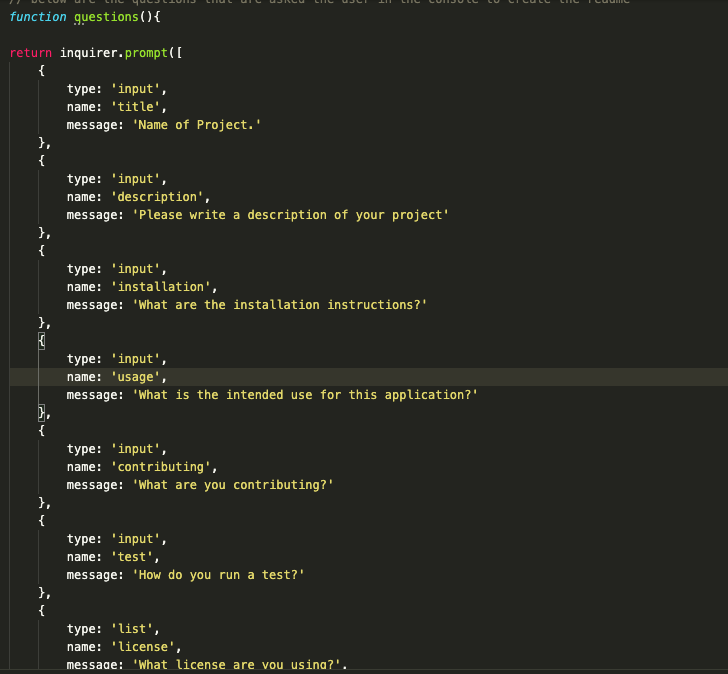
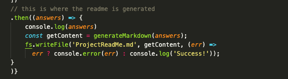
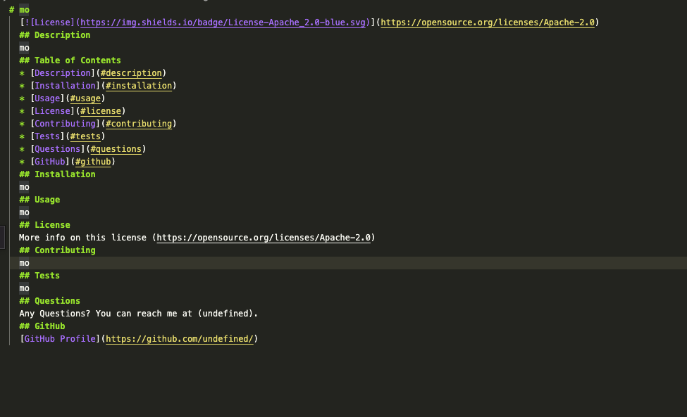
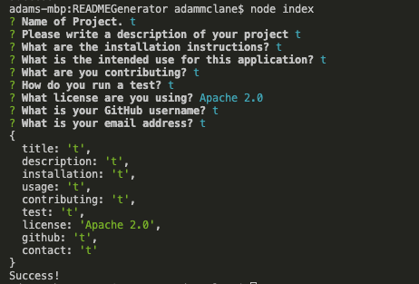

# README Generator


## About Application

This application is used to create a high quality readme file that the user can use for an application in which they make with instructions, info about the app, name, license used and contact info for the user.

## List of technologies used

- npm
- javascript
- node js
- .gitgnore

## User Story

For this homework, I had to create a way to create a high quality readme file for a specific application that the user has made. 

## My Task

My Task was to create a way for node to run in the terminal the index.js file.  With this file, it asks the questions with the npm 'inquirer'.  When the user enters the data, it will create a readme file with this information in a template that was created.

## Acceptance Citeria
```md
GIVEN a command-line application that accepts user input
WHEN I am prompted for information about my application repository
THEN a high-quality, professional README.md is generated with the title of my project and sections entitled Description, Table of Contents, Installation, Usage, License, Contributing, Tests, and Questions
WHEN I enter my project title
THEN this is displayed as the title of the README
WHEN I enter a description, installation instructions, usage information, contribution guidelines, and test instructions
THEN this information is added to the sections of the README entitled Description, Installation, Usage, Contributing, and T![ests
WHEN I choose a license for my application from a list of options
THEN a badge for that license is added near the top of the README and a notice is added to the section of the README entitled License that explains which license the application is covered under
WHEN I enter my GitHub username
THEN this is added to the section of the README entitled Questions, with a link to my GitHub profile
WHEN I enter my email address
THEN this is added to the section of the README entitled Questions, with instructions on how to reach me with additional questions
WHEN I click on the links in the Table of Contents
THEN I am taken to the corresponding section of the README
```

## Video Tutorial of README Generator

To view the video tutorial below

https://drive.google.com/file/d/14w4hiSjSui7f5CQG3whizqqg9awhNnbf/view?usp=sharing


## GitHub URL

https://github.com/mclanea92/READMEGenerator

## Contact/Questions
If you have any questions about this project, please feel free to contact me at mclanea92@gmail.com

## Screenshots

#### Screenshot below shows how the qustions are asked using inquire



#### Screenshot below shows how the questions are used to generate a readme file



#### Screenshot below shows the template of the readme where the users info is added to create the file



#### Screenshot below is the console with me doing a test showing it is a sucess


## License
MIT License

Copyright (c) 2022 Adam McLane

Permission is hereby granted, free of charge, to any person obtaining a copy
of this software and associated documentation files (the "Software"), to deal
in the Software without restriction, including without limitation the rights
to use, copy, modify, merge, publish, distribute, sublicense, and/or sell
copies of the Software, and to permit persons to whom the Software is
furnished to do so, subject to the following conditions:

The above copyright notice and this permission notice shall be included in all
copies or substantial portions of the Software.

THE SOFTWARE IS PROVIDED "AS IS", WITHOUT WARRANTY OF ANY KIND, EXPRESS OR
IMPLIED, INCLUDING BUT NOT LIMITED TO THE WARRANTIES OF MERCHANTABILITY,
FITNESS FOR A PARTICULAR PURPOSE AND NONINFRINGEMENT. IN NO EVENT SHALL THE
AUTHORS OR COPYRIGHT HOLDERS BE LIABLE FOR ANY CLAIM, DAMAGES OR OTHER
LIABILITY, WHETHER IN AN ACTION OF CONTRACT, TORT OR OTHERWISE, ARISING FROM,
OUT OF OR IN CONNECTION WITH THE SOFTWARE OR THE USE OR OTHER DEALINGS IN THE
SOFTWARE.